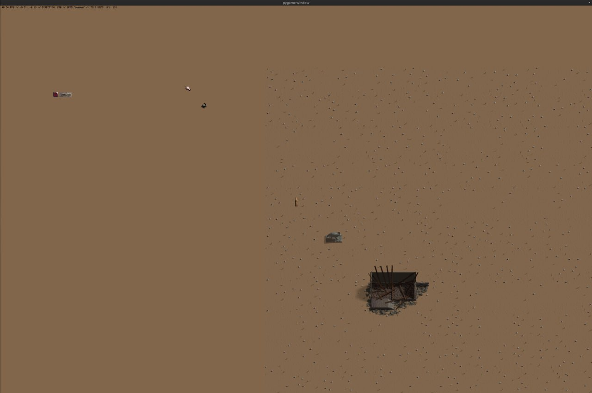

'Tis I again.

Recently I've made quite a lot of progress on a project of mine and my brothers. I dubbed it "Urchin Project" because
urchin sounds funny, but also I have zero clue what to call the game.

## What was originally

This project actually started [around 10 months ago](https://www.youtube.com/watch?v=z9P-KlNKXAA), but this version was
abandoned for a few reasons. Main one being, I had zero fucking clue what I was doing, I didn't plan out a single part
of the project, I didn't even know what the story was going to be. Quickly, there was a lot of foot-guns in place and
horribly designed systems.

Urchin Project, though not called it back then, was written on PyGame, a Python wrapper for SDL with a few helpful
features. PyGame is more than suitable for most project and tests, as its quite simple to use and relatively fast to get
the hang of when first getting into writing games. One of the biggest gripes I have with it was the software based
rendering, but that shouldn't be an issu-

oh, yeah, that. While basically impossible to see on the screenshot, what ran at 300FPS on my 1080p monitor ran at barely 40fps on
a 5k one, this was going to be an issue, not only when it came to scaling things, but also the general design of the
game.

The only option I had was either to:

1. Ignore the issue and deal with it later
2. Use something like ModernGL to make an OpenGL context, and use PyGame as the input and audio manager

Guess which I've taken!

From the [previously linked video](https://www.youtube.com/watch?v=z9P-KlNKXAA), you can see I made quite a bit of
progress on the game. I even made a [world generator of some sorts](https://github.com/Fluffy-Bean/py_map_generation)!
But it was all horribly slow, terribly implemented and wasn't going to get far, and it didn't.

Eventually I gave up and moved onto other things, such as dealing with upcoming college.

## Go

Then around October 2023 I picked up Go. Go is a pretty neat little language, it has the simplicity of Python, and a
_pythonic_ sort of syntax in some ways, but the speeds of languages such as Java!

{/* I believe I read somewhere that Go can preform faster than Rust, but I cannot find the video/resource to back this up */}

Since then, I've used Go for most of my new projects, because since then I realised that Functional is the way to go for
me.

At one point I even tried to make something using a Go SDL wrapper, but that didn't really go anywhere and I gave up
even quicker with that.

## raylib

Now, here's where things get interesting!

-   What have I been working on in the past week
-   How the project started originally
-   Why did I choose RayLib and Go over python

    -   Python was slow
    -   I didn't plan out the project well
    -   PyGame wasn't for me
    -   Gocurrency

-   Physics system

    -   SAT
    -   QuadTrees
    -   Greedy Meshing

-   What I want todo next
    -   World Generation
    -   Time/Temperature based systems
