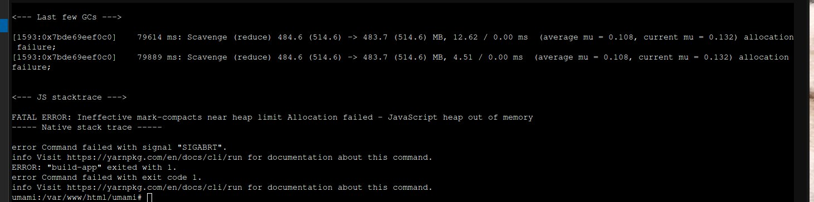

import Note from "../../components/Note.astro";

## Introduction

This little blog post thang will be about umami, and why I went with it over fixing my Plausible install. While the
reason is pretty simple, really and can be summed up in two points.

- Its resource usage is low
 - Has (nearly) all the features I used in Plausible

I want to talk a bit about how I got to the point where I chosen it, and the steps I've taken to actually install and
setup an Alpine CT with itttt

## Other options

Before I landed on umami, here's the other options I checked out, none of this is gonna really be "scientific", so do
some of your own research too, I'll provide links were ever I can, otherwise the information was brought to me in my
delusions.

### Matomo

I've seen Matomo get suggested in a few places before I went with Plausible originally, but I never checked it out till
now. While it looked solid, it also has _too_ much stuff... I didn't need or want a heatmap of interactions throughout
my website, nor session recording, or any ecommerce stuff.

Even with all that, I didn't particularly like the design, it was cluttered and confusing to go through the demo site.

### PostHog

PostHog was the second thing I've checked out, while it looked promising, it was just too much along with not solving my
problem of _having_ to use docker.

The requirements were also a bit insane for my needs, 8GBs of ram (recommended minimum) in comparison to the 256MB the
CT running umami currently has.

### Fathom

This was the last one I checked out before going with umami, I liked the design as it was similar to Plausible, and had
the feature set that I was looking for, with no complicated dashboards.

Buuuuuut, there is no self-hostable option, [kinda](https://github.com/usefathom/fathom). The lite version is no longer
maintained. Which is a shame, as it fathom looked promising and Go is a nice language to work with...

Maybe I could pick it up in the future, and bring it back to life again

### Services feature comparison

<Note text="Blank sections are due to me not being able to find information on the feature" />

|                               | Matomo | PostHog                    | umami                       | Fathom lite                  | Plausible                  |
|-------------------------------|--------|----------------------------|-----------------------------|------------------------------|----------------------------|
| Self-Hostable                 | Yes    | Yes                        | Yes                         | Yes [^fathom-self-host]      | Yes                        |
| Hosting method                | PHP    | Docker                     | Node or Docker              | Go [^fathom-language]        | Docker                     |
| GDPR compliant                | Yes    | Yes                        | Yes                         | No [^fathom-gdpr-compliance] | Yes                        |
| Email reports                 | Yes    | Yes                        |                             |                              | Yes                        |
| Tracking events               | Yes    | Yes                        | Yes [^umami-event-tracking] |                              | No                         |
| Simple (and pretty) dashboard | No     | Mostly                     | Yes                         | Yes                          | Yes                        |
| Minimum RAM                   | 1GB    | 8GB                        | 256MB [^umamo-memory-usage] |                              | 1GB                        |
| Supported Databases           | MySQL  | N/A [^supported-databases] | Postgres or MySQL           | SQLite                       | N/A [^supported-databases] |

## So what was wrong with Plausible?

Simply put, too heavy for my use-case. It was designed for websites that see thousands of people per week, maybe even a
day, but I haven't even reached a thousand views in a year! Secondly, docker, it has it's uses, but since all my
services already run in LXT/Proxmox containers, no point of putting them within another container.

All that I could've lived with fine, if not for trying to upgrade it. It broke, even in a docker container, it refused
to start after an update and wouldn't show any signs of life other that pushing my CPU usage to 100%, then freezing the
container!

Downgrading - worked. But since database migrations have been complete, a lot of the pages no longer worked, so I just
left it alone, until I was bothered with finding an alternative solution.

## umami

Finally, something I was looking for, it has all the features I need, with not too much extra stuff I'll never use. AND
it's self-hostable with a non-docker option!

Though, I did run into some issues compiling the project, specifically needing 2GBs of ram, lol


And here's a dashboard comparison, before umami and Plausible


## Now onto the fun stuff

<Note text="As mencioned before, this isn't supposed to be a full tutorial, but the steps I've taken to setup up umami" />

### Alpine

For this, I went with Alpine! It was my first time trying it, but it went great, and will probably be moving all my
services to it at some point, but that should be its own blog post. Main hurdle I had was understanding `OpenRC`, as
Alpine doesn't use `systemd`, but once I gotten used to `rc-update add <service>` and
`rc-service <service> start/stop/status` it went very smoothly.

Obviously firstly we should update all the available packages and install some useful tools

```bash
apk update
apk upgrade
apk add vim git
```

### Caddy

I didn't reaaaaaly need caddy for this, as it would mean the service would be behind two proxies, but I wanted to setup
caddy anyway. It was quite simple really
```bash
apk add caddy
rc-update add caddy
# Reboot
rc-service caddy start
# And make the required dirs and files
mkdir /var/www/html
```

Then, in `/etc/caddy`, we edit the `Caddyfile`, use your favorite editor for this, but I like vim, so for me I would run
`vim Caddyfile`. Then set the contents to the following
```caddyfile
:8080
reverse_proxy localhost:3000
```
<Note text="3000 is the default port for yarn, but adjust for your needs" />

And finally we just need to reload the service, still within `/etc/caddy`, with `caddy reload`!

### Postgres

It was slightly more manual than I'm used to on Ubuntu, but I found [a great guide by luppeng](https://luppeng.wordpress.com/2020/02/28/install-and-start-postgresql-on-alpine-linux)
that is still up-to-date as of writing this.

Then I just needed to get into the database with `psql -U postgres` and run `CREATE DATABASE umami;`.

<Note text="Creating a user specific to this service, along with setting correct network permissions, would be the safest, but you can figure that out" />

### Installing umami

The [official documentation](https://umami.is/docs/install) is the nicest, but there is some extra stuff you need todo
outside-of their tutorial

Firstly we make the required directory and clone the project `mkdir /var/www/html`

<Note text="Before you go any further, follow the official documentation, then come back :3" />

Now we're gonna set umami as a service! [They have a guide on doing that with PM2](https://umami.is/docs/install#running-umami),
but I prefer to use system native stuff, most likely for you this would be `systemd`, but if you're following along,
we'll be using `openrc`

Making a service on OpenRC is actually quite simple,[they have a guide for making services too](https://github.com/OpenRC/openrc/blob/master/service-script-guide.md). But first, make a
user for the service, such as `umami`. Next, we must make a file in `/etc/init.d`, such as `/etc/init.d/umami`. You can
do this by simply running `vim /etc/init.d/umami` that'll create and open the file for you. Then enter the following

```bash
#!/sbin/openrc-run

YARN_USER="umami"
PROJECT_DIR="/var/www/html/umami"
YARN_CMD="/usr/local/bin/yarn start"
APP_NAME="umami"

command="$YARN_CMD"
command_args="start"
command_user="$YARN_USER"
pidfile="/var/run/${APP_NAME}.pid"
output_log="/var/log/${APP_NAME}.log"
error_log="/var/log/${APP_NAME}_error.log"

depend() {
    need net
}

start() {
    ebegin "Starting ${APP_NAME}"

    start-stop-daemon --start --user "$YARN_USER" \
                      --make-pidfile --pidfile "$pidfile" \
                      --chdir "$PROJECT_DIR" \
                      --exec "$command" -- $command_args >> "$output_log" 2>> "$error_log" &

    eend $?
}

stop() {
    ebegin "Stopping ${APP_NAME}"

    start-stop-daemon --stop --pidfile "$pidfile"

    eend $?
}
```

and run the following - same - commands as we did earlier for caddy

```bash
rc-update add umami
# Reboot
rc-service umami start
```

And we're done! Depending on your network setup, and if you used caddy or not, you should be able to visit the page from
something like `192.168.0.0:8000`, the default login is `admin`, `umami`.

## Some thoughts

You may also now notice new text on the bottom of the page

> This website tracks anonymous analytics. To see them in action visit umami.leggy.dev!

So far, I really enjoyed using umami, it's a nice project! But if you really don't like the idea of your visit being
counted, just paste the following into the JS console of your browser.

```js
localStorage.setItem("umami.disabled", 1);
```

All following visits will no-longer be counted. While I'd prefer your _not_ to remove yourself from the statistics, as
they're useful to me, you have the option to now.

[^fathom-self-host]: The paid version, that most people are probably know about, isn't self-hostable
[^fathom-language]: The self-hosted (lite) version uses Go, the paid version uses [Laravel](https://github.com/usefathom/fathom/issues/336#issuecomment-1079549690).
[^fathom-gdpr-compliance]: The paid version of Fathom [does comply, through their isolation layer](https://usefathom.com/features/eu-isolation), the lite version does not guarantee this.
[^umami-event-tracking]: unami doesn't track events automatically [and needs to be setup manually across the website](https://umami.is/docs/track-events).
[^umamo-memory-usage]: unami doesn't list minimum requirements, so far from my testing, this is about what I needed for all my websites. For installs that have higher page visit counts, I imagine more would be needed.
[^supported-databases]: The service is run within Docker containers, so I don't get to choose what database I can actually use :(
